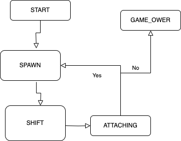

# BrickGame v1.0 — Tetris

Терминальная реализация классического тетриса на языке C. Игра разделена на два независимых слоя: логика игры, реализованная на основе конечного автомата, и терминальный интерфейс на `ncurses`.



## Возможности

- Все 7 видов фигур (I, J, L, O, S, Z, T).
- Вращение фигур, перемещение влево/вправо, ускоренное падение.
- Показ следующей фигуры в боковой панели.
- Уничтожение заполненных линий.
- Завершение игры при достижении верхней границы поля.
- Подсчёт очков и сохранение рекорда между запусками.
- Система уровней: каждые 600 очков уровень повышается, скорость падения растёт (максимум 10 уровней).
- Пауза и корректный выход из игры.

## Технологии

- Язык: C11 (`gcc`).
- Интерфейс: библиотека `ncurses`.
- Тестирование: библиотека `check`.
- Сборка: Makefile.

## Структура проекта

```
src/
├── game.h                  # общие типы данных и константы
├── game.c                  # точка входа (main)
├── fsm_loop.c / fsm_loop.h # главный цикл конечного автомата
├── brick_game/tetris/      # библиотека логики игры
│   ├── backend.c
│   └── backend.h
├── gui/cli/                # терминальный интерфейс (ncurses)
│   ├── frontend.c
│   └── frontend.h
├── tests/                  # unit-тесты (check)
├── dvi/                    # документация (LaTeX)
├── Makefile
└── Diagram.png             # диаграмма конечного автомата
```

## Сборка и запуск

Сборка и установка выполняются из каталога `src`:

```bash
cd src
make            # сборка, запуск тестов и отчёта покрытия
make install    # собрать библиотеку и исполняемый файл
make run        # запустить игру
make uninstall  # удалить собранные артефакты
make clean      # очистить артефакты сборки
```

Доступные цели Makefile: `all`, `install`, `uninstall`, `clean`, `test`, `gcov_report`, `run`, `style`, `clear`. Исполняемый файл и статическая библиотека `libtetris.a` собираются в каталог `src/build`.

### Управление

| Клавиша        | Действие                          |
|----------------|-----------------------------------|
| `Enter`        | Начать игру                       |
| `←` `→`        | Движение фигуры влево / вправо    |
| `↓`            | Ускоренное падение                |
| `↑`            | Не используется в данной игре     |
| `Пробел`       | Вращение фигуры (действие)        |
| `p`            | Пауза                             |
| `q`            | Завершение игры                   |

## Игровые механики

### Игровое поле

Поле имеет размер 10×20 «пикселей». Фигура останавливается, достигнув нижней границы или столкнувшись с другой фигурой; далее генерируется следующая фигура, показанная в превью.

### Подсчёт очков

| Уничтожено линий | Очки |
|------------------|------|
| 1                | 100  |
| 2                | 300  |
| 3                | 700  |
| 4                | 1500 |

Рекорд сохраняется в файл `highscore.txt` и обновляется, если текущий результат его превышает.

### Уровни

Каждые 600 очков уровень повышается на 1. С каждым уровнем скорость падения увеличивается. Максимальный уровень — 10, скорость ограничена снизу (не быстрее 100 мс на шаг).

## Конечный автомат

Логика игры основана на конечном автомате со следующими состояниями:

- `START` — ожидание старта игры;
- `SHIFT` — движение фигуры (обработка перемещения и падения по таймеру);
- `ATTACHING` — фигура достигла нижней границы, фиксация на поле, удаление заполненных линий;
- `SPAWN` — генерация новой фигуры; если поле переполнено — переход к завершению;
- `GAME_OVER` — завершение игры при достижении верхней границы поля.

Схема состояний и переходов приведена в `src/Diagram.png`.

## Архитектура

Библиотека логики (`src/brick_game/tetris`) предоставляет интерфейс через функции `updateCurrentState()` и `userInput()`, полностью отделённый от отрисовки. Интерфейс (`src/gui/cli`) отвечает только за вывод состояния поля и дополнительной информации. Разделение позволяет независимо тестировать игровую логику.

## Тестирование

Unit-тесты написаны на библиотеке `check` и покрывают логику игры (FSM, генерацию фигур, вращение, сдвиг, удаление линий, очки, уровни, сохранение/чтение рекорда).

```bash
cd src
make test        # запуск тестов
make gcov_report # отчёт о покрытии кода (в src/report/)
```

## Стиль кода

Код написан в соответствии с принципами структурного программирования и Google Style. Форматирование выполняется целью Makefile:

```bash
cd src
make style
```